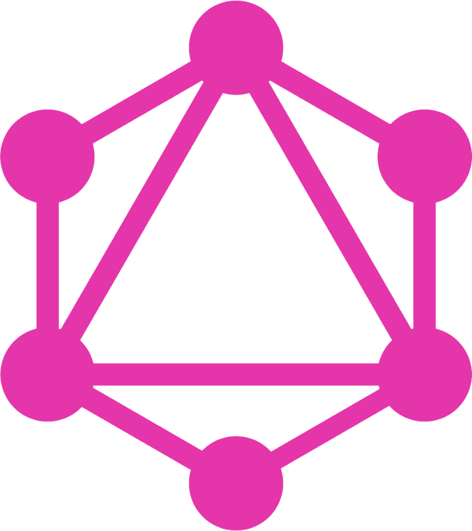

# heroes
Full-stack GraphQL app based on Node, Express, React, Relay, MongoDB

## We have two models:

### Hero
### Skill

A Hero may have many skills (or nothing))

Allowed operations: create, read, update, delete

Removing Hero will remove all related skills.

The server is configured with Mongodb cloud connection, so you can configure your own settings in ```.env``` file.

# Used technologies





